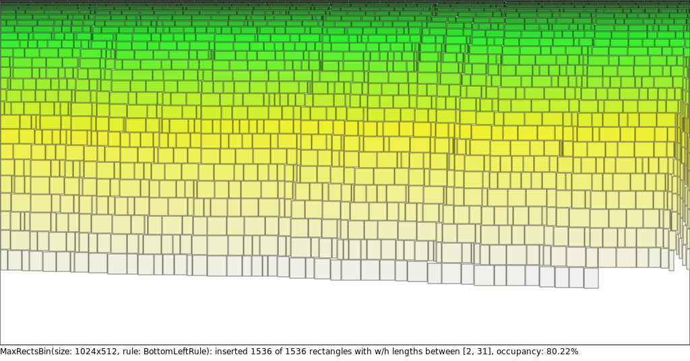
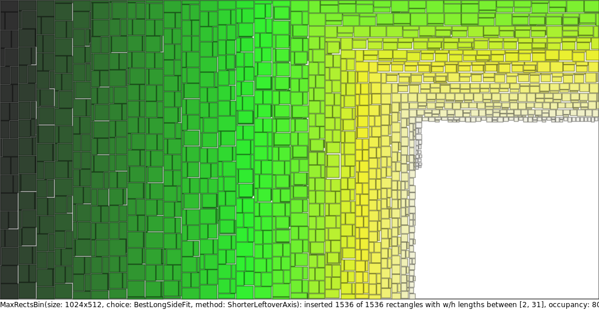
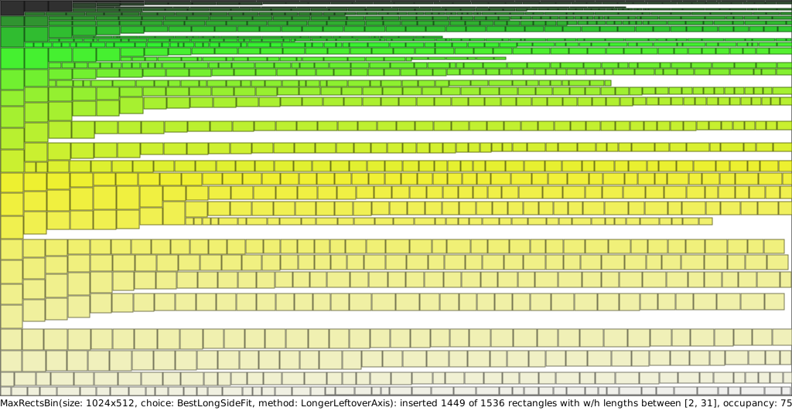
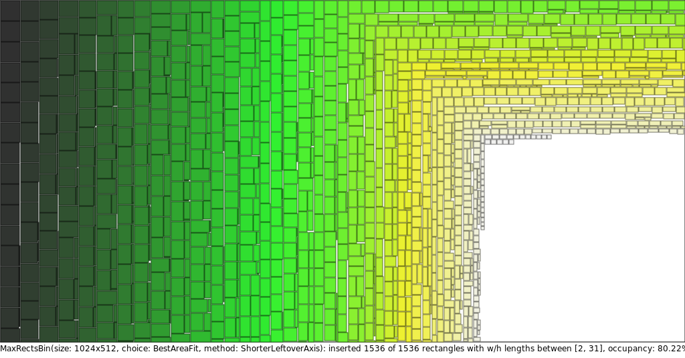
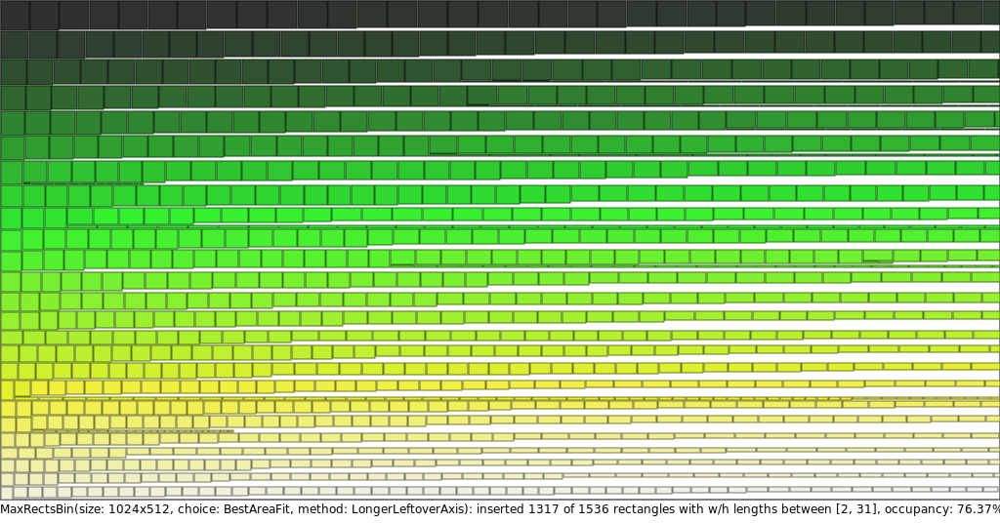
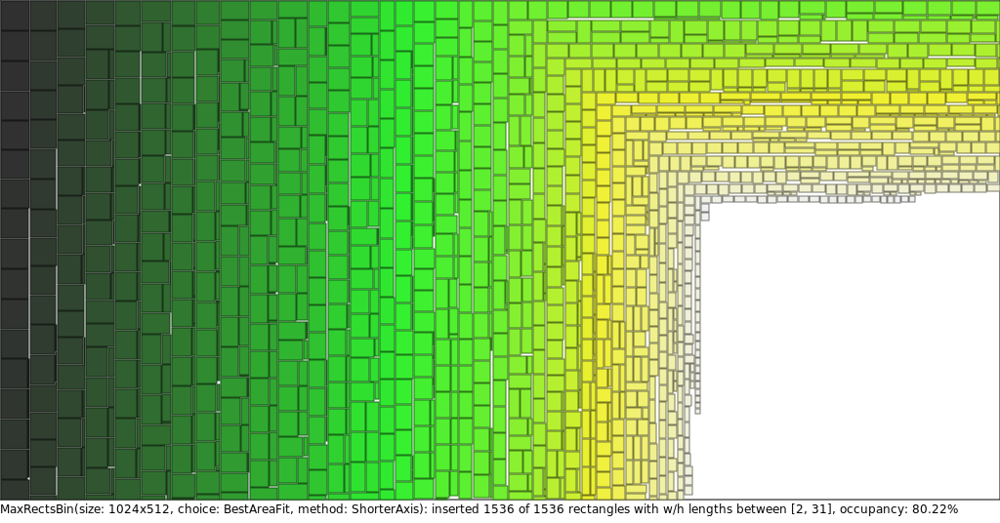

# Comparison of bin packing methods and their individual subvariants

## MaxRects bin packing algorithm

  
<strong>Rule: BestShortSideFit</strong>

  

  
<strong>Rule: BestLongSideFit</strong>

  

  
<strong>Rule: BestAreaFit</strong>

  

  
<strong>Rule: BottomLeftRule</strong>

  

  
<strong>Rule: ContactPointRule</strong>

  

## Guillotine bin packing algorithm

### Choice: BestShortSideFit

  
<strong>Method: ShorterLeftoverAxis</strong>

  

  
<strong>Method: LongerLeftoverAxis</strong>

  

  
<strong>Method: MinimizeArea</strong>

  

  
<strong>Method: MaximizeArea</strong>

  

  
<strong>Method: ShorterAxis</strong>

  

  
<strong>Method: LongerAxis</strong>

  

### Choice: BestLongSideFit

  
<strong>Method: ShorterLeftoverAxis</strong>

  

  
<strong>Method: LongerLeftoverAxis</strong>

  

  
<strong>Method: MinimizeArea</strong>

  

  
<strong>Method: MaximizeArea</strong>

  

  
<strong>Method: ShorterAxis</strong>

  

  
<strong>Method: LongerAxis</strong>

  

### Choice: BestAreaFit

  
<strong>Method: ShorterLeftoverAxis</strong>

  

  
<strong>Method: LongerLeftoverAxis</strong>

  

  
<strong>Method: MinimizeArea</strong>

  

  
<strong>Method: MaximizeArea</strong>

  

  
<strong>Method: ShorterAxis</strong>

  

  
<strong>Method: LongerAxis</strong>

  

### Choice: WorstShortSideFit

  
<strong>Method: ShorterLeftoverAxis</strong>

  

  
<strong>Method: LongerLeftoverAxis</strong>

  

  
<strong>Method: MinimizeArea</strong>

  

  
<strong>Method: MaximizeArea</strong>

  

  
<strong>Method: ShorterAxis</strong>

  

  
<strong>Method: LongerAxis</strong>

  

### Choice: WorstLongSideFit

  
<strong>Method: ShorterLeftoverAxis</strong>

  

  
<strong>Method: LongerLeftoverAxis</strong>

  

  
<strong>Method: MinimizeArea</strong>

  

  
<strong>Method: MaximizeArea</strong>

  

  
<strong>Method: ShorterAxis</strong>

  

  
<strong>Method: LongerAxis</strong>

  

### Choice: WorstAreaFit

  
<strong>Method: ShorterLeftoverAxis</strong>

  

  
<strong>Method: LongerLeftoverAxis</strong>

  

  
<strong>Method: MinimizeArea</strong>

  

  
<strong>Method: MaximizeArea</strong>

  

  
<strong>Method: ShorterAxis</strong>

  

  
<strong>Method: LongerAxis</strong>

  

